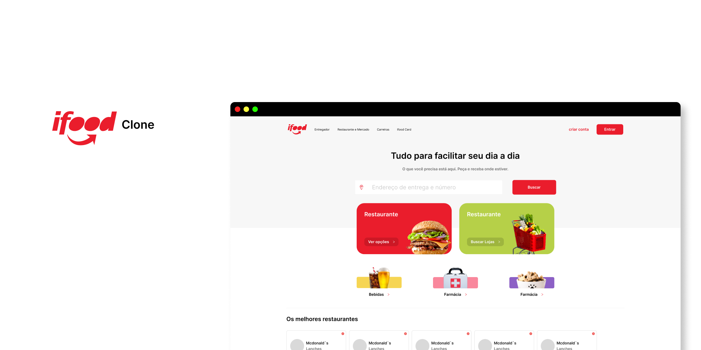

<h1 align="center">Ifood Clone</h1>

  Interface desenvolvida como parte do treinamento de html e css

Tecnologias aprendidas:
  - Html 5
  - Css
  - Tailwindcss

Você pode ver a interface no link abaixo:

<a href="https://www.figma.com/file/XnL7yzGwgWR5XYKu2l8qao/Ifood---Clone?type=design&node-id=0%3A1&mode=design&t=QxylnI9q7iOYQn2g-1"> Clique aqui